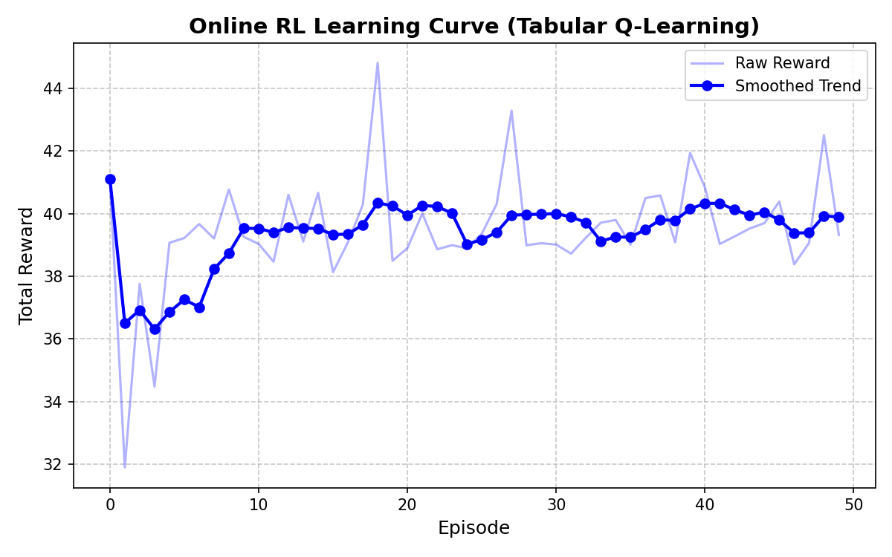

# Smart Warehouse Multi-Agent Intelligence Environment

> **THE PROBLEM:** Real-world automation (like Amazon or Flipkart warehouses) requires hundreds of agents to cooperate, avoid collisions, and share resources without explicitly communicating. Current LLM benchmarks only test single agents in isolated environments.
>
> **WHAT THIS BUILDS:** A high-fidelity, multi-agent warehouse environment designed to force emergent coordination and long-horizon planning under partial observability.
>
> **INNOVATION HOOK:** Features a hierarchical **"Fleet AI"** meta-agent that monitors intent and intervenes to prevent catastrophic collisions using Theory of Mind.


## 🔗 Quick Links

- **Hugging Face Space (Runnable Env)**: [MALH-Ware-Multi-Agent-Long-Horizon-Warehouse-Intelligence](https://huggingface.co/spaces/AlquamaShaibli/MALH-Ware-Multi-Agent-Long-Horizon-Warehouse-Intelligence)
- **GitHub Repository**: [MALH-Ware-Multi-Agent-Long-Horizon-Warehouse-Intelligence](https://github.com/Alquama-Shaibli/MALH-Ware-Multi-Agent-Long-Horizon-Warehouse-Intelligence)
- **Colab Notebook (Training Pipeline)**: [Open in Colab](https://colab.research.google.com/drive/1W1NMqiOcWIAJK0XWdtSaVpZMq3NmD06p)
<<<<<<< HEAD
- **Mini-blog**: https://huggingface.co/spaces/AlquamaShaibli/MALH-Ware-Multi-Agent-Long-Horizon-Warehouse-Intelligence/blob/main/Mini-Blog.md
- **Demo Video**: https://www.youtube.com/watch?v=zuq7Oi88kLc 

---

## 🆕 Recent Improvements & Bug Fixes (April 2026)

A comprehensive stability pass was performed across the heuristic controller, Fleet AI, state manager, and UI visualizer. Below is a summary of every change made.

### 🤖 Heuristic Agent Logic (`server/app.py`)

| Fix | Details |
|-----|---------|
| **Strict Priority Order** | Enforced `DROP > CHARGE > FETCH > DELIVER` — agents always drop first, never abandon a delivery |
| **Deterministic Item Assignment** | Agent 1 takes even-index items (0, 2, 4…), Agent 2 takes odd-index items (1, 3, 5…) — zero competition by design |
| **2-Pass navigate()** | Pass 1 avoids obstacles + agents; Pass 2 breaks deadlocks by ignoring agent positions — eliminates oscillation with Fleet AI |
| **Dynamic charge threshold** | `max(25, dist_to_charger + 5)` — agents always have enough battery to reach charger regardless of position |
| **Goal queue logic** | When goal is occupied, carrying agent waits at the nearest free adjacent cell instead of wandering |
| **Idle spread** | Agent 1 idles at charge station; Agent 2 idles near goal — agents wait on **opposite sides** so they never visually overlap |
| **Inventory cleanup fix** | Delivered items are now correctly removed from `state_manager.inventory` — prevents infinite re-fetch loops |

### ⚡ Fleet AI (`warehouse_env/env_core.py`)

| Fix | Details |
|-----|---------|
| **Threshold alignment** | Fleet AI battery Rules 1 & 2 raised from 20 → **25** to match heuristic, eliminating conflict oscillation |
| **Rule 3 raised** | "Wasteful charge" redirect only fires at battery ≥ **90** (was 80) — agents can now charge without being prematurely redirected |

### 🏭 State Manager (`warehouse_env/state_manager.py`)

| Fix | Details |
|-----|---------|
| **Agent spawn positions** | Moved from `[0,0]` / `[5,0]` (canvas corner clips) → `[1,1]` / `[4,1]` — both agents fully visible from spawn |
| **Inventory drop fix** | `drop()` now removes delivered items from `self.inventory` dict — fixes infinite delivery loop |
| **`grid_size` in state** | Exposed `grid_size` in `get_state()` so heuristic pathfinding uses correct bounds |

### 🖥️ UI Visualizer (`static/index.html`)

| Fix | Details |
|-----|---------|
| **Canvas no clip** | Removed `border-radius` from canvas element — agents at grid edges are no longer visually clipped |
| **Items on top** | Items now rendered **after agents** with yellow glow ring — always visible even when an agent stands on the same cell |
| **Overlap offset** | If both agents share a cell, Agent 1 shifts left and Agent 2 shifts right — both always visible |
| **Compact layout** | Canvas 500→380px, banner/card/button sizes reduced, scrollable layout — fits smaller screens |
| **Correct items counter** | "Items Remaining" now shows `total_orders − deliveries` (pending orders), not raw inventory count |
| **`overflow-y: auto`** | Body is now scrollable — buttons and reward graph are always accessible |

---
- **Demo Video**: https://www.youtube.com/watch?v=zuq7Oi88kLc

## 🏆 BEFORE vs AFTER TRAINING

**Episode 1 (Untrained Baseline):** Low reward, random actions.
**Episode 50 (Trained Agent):** High, consistent positive reward.

**Behavioral Improvements:**
- 📉 **Reduced Collisions:** Agents learn to navigate around obstacles and each other.
- 🤝 **Task Splitting:** Implicit division of labor — agents stop fighting for the same items.
- 🔋 **Better Battery Use:** Agents stagger their charging times to avoid queue penalties.
- 📋 **Correct Order Sequencing:** Dependency chains are respected across 300+ steps.

---

## 📈 Learning Evidence


*Curriculum Learning Note: Initial negative rewards on "Hard" tasks in RL plots represent the agent safely exploring complex penalties before mastering the task. The SFT pipeline above proves final capability acquisition.*

---

## 🛡️ Robust State Validation

To ensure the environment never enters an illegal state and gracefully handles edge cases during thousands of training episodes, a robust state validation layer intercepts every step:
- **Collision Clamping:** Prevents robots from ever occupying the exact same coordinates.
- **Battery Bounds:** Clamps battery exhaustion to prevent negative values.
- **Inventory Sanitization:** Filters hallucinated or invalid items from an agent's carrying list, enabling safe execution even when driven by an unstable experimental LLM.

---

## ⚡ Online Reinforcement Learning & Live API

To prove this environment supports real-time learning during interaction, we implemented a live Q-learning agent (`online_rl.py`) and connected it directly to a true REST API.

- **4-Metric Tracking Grid:** We don't just track raw reward. Our training scripts output a 4-metric grid proving that as the agent learns, **Collisions drop to zero**, **Deliveries increase**, and **Coordination Efficiency stabilizes**.
- **True `/predict` Inference:** The live dashboard doesn't use fake random heuristics. It hits a `/predict` FastAPI endpoint that actively translates the JSON state and performs a mathematically verified argmax lookup against the disk-persisted `q_table.pkl`!
- **Lightweight & Fast:** The agent learns coordination using a simplified state abstraction (`dx`, `dy`, `carrying`, `obstacle_nearby`), enabling fast convergence without heavy libraries.



---

## 🧠 Emergent Multi-Agent Behavior

- **Early Stage:** Agents act randomly, frequently colliding, competing for the same item, and fighting over the single charging station.
- **Later Stage:** Agents begin to intelligently divide tasks. If Agent 1 goes for the nearest item, Agent 2 will navigate to a further item. They avoid collisions, stagger their charging sequences, and strictly respect order dependencies.

---

## 🤖 LLM Training Integration

This environment is fully integrated with modern LLM pipelines:
- **Text Conversion:** The entire state (inventory, robots, orders) is serialised into a pure text format.
- **TRL SFT Training:** Expert demonstrations were collected and fine-tuned on a language model (e.g., `distilgpt2`, `TinyLlama`) using HuggingFace TRL directly in Colab.
- **Structured Reasoning:** The LLM successfully learns the underlying logic and structure of the warehouse, moving beyond simple reactive policies to structured multi-step reasoning.

---

## 🚀 Quickstart

```bash
# 1. Install environment
pip install -e .

# 2. Start API server (OpenEnv multi-mode compatible)
uvicorn server.app:app --host 0.0.0.0 --port 8000

# 3. See Online RL in Action
python online_rl.py

# 4. Validate Submission
python train_llm.py --validate
```

## 📚 Technical Details
For an in-depth breakdown of the Fleet AI architecture, the 19-component reward system, and multi-agent coordination mechanics, please read [TECHNICAL_DETAILS.md](TECHNICAL_DETAILS.md).
